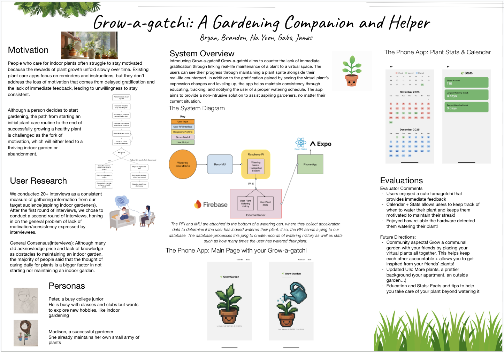

# 🌱 CS 188 HCI Grow Garden


Authored by Na-yoon Kang, Brandon Huang, James Wang, Gabriel Macatula, and Bryan Mui

---

## 🧭 Overview

This repository contains an [Expo](https://expo.dev) project bootstrapped with [`create-expo-app`](https://www.npmjs.com/package/create-expo-app). It powers Grow Garden, an HCI project focused on making plant care playful and trackable.

You can start developing by editing files inside the `app` directory. The project uses [file-based routing](https://docs.expo.dev/router/introduction), so new routes are just new files.

The source code run on our Raspberry Pi 5 is located at https://github.com/Gafrindle/grow-garden-hardware

An overview of this project can be seen in the below showcase poster.


---

## 🚀 Quick Start

1. **Install dependencies**

   ```bash
   npm install
   ```

2. **Start the dev server**

   ```bash
   npx expo start
   ```

The Expo CLI output lets you launch the app via:

- [development builds](https://docs.expo.dev/develop/development-builds/introduction/)
- [Android emulator](https://docs.expo.dev/workflow/android-studio-emulator/)
- [iOS simulator](https://docs.expo.dev/workflow/ios-simulator/)
- [Expo Go](https://expo.dev/go) for lightweight testing

---

## 🌼 First Interaction Tutorial

1. Launch the app (desktop browser, Android emulator, or iOS simulator) and wait for the Grow Garden logo to bloom.
2. Tilt watering can to begin hydrating your plant.
3. Continue watering until you see the plant's water bar has filled up, and a watering can appears above the sprite.
4. 🎉 Daily watering complete! The session is now logged.

---

## 🌼 Second Interaction Tutorial

1. Launch the app (desktop browser, Android emulator, or iOS simulator) and wait for the Grow Garden logo to bloom.
2. Tap the "Stats" button to look at the stats page.
3. Tap the return arrow to return to the home page.
4. Tap the "Calendar" button to look at the calendar page.
5. Tap the return arrow to return to the home page.

---

## 📚 Helpful Resources

- [Expo documentation](https://docs.expo.dev/) — fundamentals plus deep dives
- [Guides collection](https://docs.expo.dev/guides/) — recipes for common tasks
- [Learn Expo tutorial](https://docs.expo.dev/tutorial/introduction/) — build a cross-platform app step by step