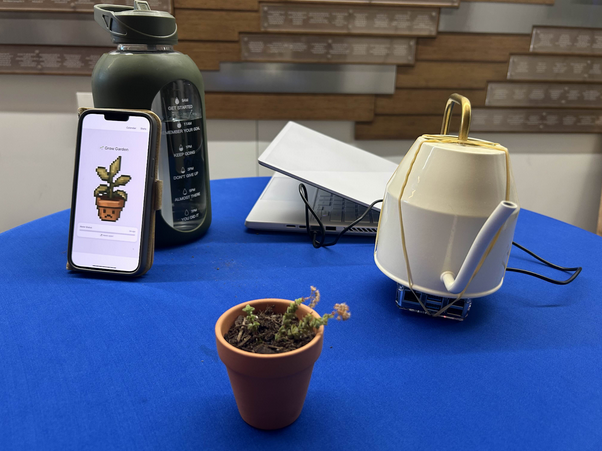
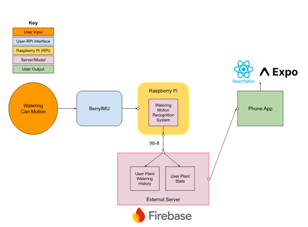

# Introduction

Introducing Grow-a-gatchi! Grow-a-gatchi aims to counter the lack of immediate gratification through linking real-life maintenance of a plant to a virtual space. The users can see their progress through maintaining a plant sprite alongside their real-life counterpart. In addition to the gratification gained by seeing the virtual plant’s expression changes and leveling up, the app helps maintain consistency through educating, tracking, and notifying the user of a proper watering schedule. The app aims to provide a non-intrusive solution to assist aspiring gardeners, no matter their current situation. 

Figure 1: Photo of system from 12/3 Design Showcase

# Problem Statement  

People who care for indoor plants often struggle to stay motivated because the rewards of plant growth unfold slowly over time. Existing plant care apps focus on reminders and instructions, but they don’t address the loss of motivation that comes from delayed gratification and the lack of immediate feedback, leading to unwillingness to stay consistent. 

Although a person decides to start gardening, the path from starting an initial plant care routine to the end of successfully growing a healthy plant is challenged as the fork of motivation, which will either lead to a thriving indoor garden or abandonment. We would like to focus directly on the motivational aspect pertaining to gardening, hoping to build a system that would keep users motivated and engaged.

#  User research  

Our first round of user research was before we even had the idea of implementing a hardware system; rather, we wanted to dive into what the barriers of gardening are from our interviewees' perspectives and what keeps them motivated for any activity. We knew going into our semi-structured interviews that some people feel hesitant to start their own gardens, but we did not know exactly why. We had assumed that the reason would be a combination of the cost and research required, but we learned from our interviews that another major reason was lack of patience and motivation. One interviewee in particular essentially noted that although she would like a garden for the sake of aesthetics, she knows she doesn't have the patience and consistency to keep the garden alive. One mistake that we made during the first round of interviews was to ask questions that were not as directed towards gardening. This was helpful initially to explore more into the problem space of habit building, but it wasn’t as helpful to address the problem statement that we outlined for the quarter.

Thus, for our second round of interviews, we decided to hone in on the problem space of motivation in gardening. Going into this round of user research, we expected to encounter a good number of people who had previously tried gardening but stopped after a few months due to lack of motivation. We knew that this lack of motivation can stem from various reasons, like delayed gratification, and such. However, something that surprised us was how many people cited a lack of knowledge as a contributor to their lack of motivation. For example, one person explained how, when something went wrong with their plant, they initially tried to resolve the issue but ended up giving up because of all the extra work and research that would have been needed to truly rescue the plant. Another interesting point mentioned by a few users was the lack of accountability. A decent number of users stated they’d feel more accountable and motivated if the plant they were taking care of were someone else’s, or just somehow tied to other people, rather than it just being themselves and the plant. 

The idea of accountability is what eventually led us to the idea of a tamagotchi, with a planned but so far unimplemented idea of a community system for people to hold each other accountable. The tamagotchi serves to provide a digital companion for the user, where the user must take care of their garden in order to keep the tamagotchi alive and happy. For this idea, we drew inspiration from mentions of apps like Duolingo and BeReal in our previous interviews; for some interviewees, having a digital reminder or visual motivation was a large part of staying motivated. The tamagotchi app also tracks user statistics, which was another idea we drew from user interviews; some people noted that they were motivated in other pursuits because of obvious progress, so we wanted to introduce some kind of numerical progress in our system.

# Design goals

Our goal is to design a mobile app that gamifies the plant care experience and provide quick gratification through taking care of a digital plant that follows the care you give to your real plant, while also providing information and reminders regarding plant care. We ended up pivoting from the original mobile app design to a hardware system that was integrated with a mobile app. We made this design goal after the first crit, where concerns about the disconnect between logging habits in the app and making progress and real life plant care were mentioned. We ended up using the hardware solution as a goal to create an unobtrusive solution that connected both plant care and utilizing the app

This was important because we found through our research that many people struggle to take care of plants because of delayed gratification and a lack of motivation. It was a major point of contention when interviewing our users. One interviewee said roughly, when comparing gymming to gardening, "Gymming has more direct impact on you; plants are just something you see; the effect they have on your life is not as big."

Another goal we had was to design a mobile app that provided social interaction and a sense of community through a shared digital garden with pre-selected users. The shared digital garden could reflect each user’s plant condition for others to see, encourage and remind one another of them. We wanted to incorporate competition in the experience of gardening, as a good means to keep users motivated.

According to our user research, social factors are what motivate a lot of people to use apps like BeReal and Instagram. They cited how they loved opening those apps compared to other apps. Something about instant gratification and socialization appealed to them especially. Specifically, having others join your activity directly or indirectly can foster more motivation as well as a sense of accountability. So we figured adding such a feature to our app would help motivate people to garden as well.

# System design and implementation

This system implements a traditional tamagotchi software system in combination with a Raspberry Pi (RPi) 5 and BerryIMU, where the RPi and IMU are attached to the bottom of a watering can. At a high level, our system is essentially a smart watering can that automatically detects when the user has watered their plant and tracks these interactions through a phone app.

For specifics on the hardware side, the IMU constantly feeds the RPi acceleration data which the RPi then uses to calculate the IMU's angle. This process makes use of and slightly modifies [Ozzmaker's BerryIMU library](https://github.com/ozzmaker/BerryIMU) for the purpose of pipelining the data. The angle readings calculated from the IMU are processed in a simple python script running locally on the RPi; this python script essentially times how long the user has held the watering can at a certain angle and determines if the time is enough to constitute a watering action. If so, the RPi sends a ping to our dedicated Firebase database with a timestamp and other metadata, and our software takes over from there.

Figure 2: Block diagram of the Grow-a-Gatchi system

On the software side, the app itself contains an animated tamagotchi as well as two subpages, the calendar page and statistics page. The app constantly listens for changes in the database records triggered by the hardware and plays a watering animation for the tamagotchi whenever a watering event is detected. The stats and calendar pages are simultaneously updated with the new watering event, as they draw data from the database as well. The calendar page essentially shows past days where the user has or hasn't watered their plant as well as future days where the user should water their plant, and the statistics page shows how many times they've watered their plant, their longest watering streak, and their current watering streak. 

# Evaluation question, methods, and analysis approach, incorporating feedback from course staff (story about pivot)

### The Pivot:  

After our crit, we went to the design studio to discuss a problem within our project. As suggested by London, by having a software-only system, the user may be overburdened or not correctly utilize the app and correlate taking care of the plant with motivation. 

Take this complicated user flow as an example. A user may navigate to the app to figure out what plant they need to water, put down the phone to perform the real world duties of filling up the watering can, pouring the water, then coming back to the phone to mark the plant as watered. This actually makes the plant care process even more intensive than just watering it normally. In addition, our project runs the risk of a user solely taking care of their plant virtually, never actually watering it but noting that they did water it.

Both these problems were antithetical to our original goal to assist people with the motivation to take care of their plant. Therefore, we needed a small pivot of incorporating a hardware component in order to make the user flow less intensive by directly incorporating the reward mechanism to the physical act of taking care of the plant. 

While we talk about some of the other alternatives in our future research, our system ended up incorporating an IMU (Inertial Measurement Unit, a device that can detect the angle at which it is tilted) onto a watering can to detect when it is being tilted. This would then send information back to our app to note that the plant had been watered. 

### Evaluation Question and Method:

For the evaluation of our system, we mainly wanted to address two questions:

1. Is our system any more difficult or confusing to use than a normal watering can?  
2. Does our system have an impact on people's motivation to garden?

The first question relates to our goal of wanting to make the experience of actual plant care and using our system to be seamless. Ultimately, we want users to find using our system to be natural. The second question is essentially the main motivation behind our system: addressing the drop in motivation and engagement during plant care. The metrics that we planned to measure these questions as are follows:

**Q: Is our system any more difficult or confusing to use than a normal watering can?**

* Quantitative Metric: Time needed before user realizes what they are supposed to do with our system’s watering can  
  * Users should know immediately what to do with a normal watering can; measuring how long it takes for people to realize how to use our system is a good metric for why much more confusing or intimidating our system might be.

**Q: Does our system have an impact on people's motivation to garden?**

* Quantitative Metric: Number of missed watering days in a 30-day period

However, due to heavy time constraints, we can’t possibly measure the number of missed watering days in a 30-day period. Realistically speaking, we somehow have to measure how motivated the user feels from the initial use of our system. Thus for our usability tests, we decided on taking a more qualitative approach, to answer this question. Specifically, we gauged their reaction to seeing the plant change from being sad to happy (after watering), or happy to sad (when water level drops). Although this is not an effective way of measuring motivation, we find it suitable given the constraints we had. 

# Findings

We conducted a total of 3 usability tests. In terms of the time needed for users to understand how the system works, all except for one user knew how to use our system immediately, which was shown by them immediately tilting the watering can to water the plant. One user knew fairly quickly what to do with the watering can (after thinking for 2 seconds). This gave us the impression that our system is quite easy to understand and that its use along with the actual plant care experience (which in this case is just watering) is seamless. 

In terms of the impact on people’s motivation to garden, two users seemed to show positive reactions when using our system. This was gauged by simply observing the users’ changes in expression. One user also mentioned growing an emotional attachment to the plant when they saw it go from happy to sad. However, one user stated that the system would not help in keeping them motivated with plant care, not because the system is ineffective, but due to personally not caring about plants in general. Although we can’t conclude that our system is effective or ineffective in addressing motivation in plant care, these results give us an initial impression on what our system can do. Specifically, bridging an emotional connection between the user and the plant through our app might prove to be effective in making users stay engaged with their plants. 

Besides the findings to our evaluation questions, all users found the app interface to be quite intuitive and navigated to different pages with ease. Two users stated that the stats page was a little underwhelming, and that adding achievements, medals, or something more impactful would give the stats more weight, which can also result in a boost in motivation. Users have also mentioned that being able to cycle between different plants, and having a community garden would have been nice features to implement, if we had the extra time. 

# Discussion of takeaways based on the evaluation, limitations and future work, mistakes and lessons learned  

### Limitations:

Our limitations in this project can be classified into two categories: user/research limitations and app/functionality limitations. 

One of our user limitations was the fact that as college students, our demographics of our user research were mostly also college students. This was a big constraint as college students are typically 1\) very busy and 2\) live in very constrained housing. Therefore when we were doing research, most users interviewed were beginners in growing plants and had plants that were already low maintenance, such as succulents. While we were still able to analyze the psyche of these users, usability tests \+ interviews on whether they would use the product were more biased. If you water your small plant once a week directly from the sink, a project that uses Raspberry Pi connected to a watering can that sends data to an app on your phone complicates the plantcare process, not simplifying it. However, when talking to more of our expert interviewees who tended to be older and with their own houses/bigger gardens, the use of a hardware component and the features was more justified as taking care of their garden was a bigger task. 

Some of our app limitations were created because of budget or time constraints. For example, the purpose of our hardware was to tie taking care of your plant with immediate feedback. However, our flow still had users balance using their phone with real life actions. A more ideal flow talked about in our future work would be to integrate all the digital feedback on the watering can or on the plant itself.

Another app limitation was the amount of features we coded into the mobile app. We didn’t have time to add features such as a social aspect, individualized plant care plans, or a cleaner UI. For example, one limitation users noted was that there was no overwatering animation, penalizing you for drowning your plant. In fact, our app motivated users to consistently overwater their plant. 

### Future work:  
These limitations inform what our future work for this project could look like. With more time dedicated to working on this project, we would revamp each step, from the user research to the hardware integration to the software design.

With user research, we focused a lot on motivation with plant care. However, if we were given more time and resources, it would’ve been very interesting to do research on motivation agnostic to plant care. For example, by polling people who had been dedicated to their hobbies primarily due to an app’s help, we may be able to design our software with the same tools. While we already have features such as individualized streaks, further user research on the social aspects like peer pressure, leaderboards and competition, and friend streaks may have unlocked a new insight for us to further explore. In addition, we would also do further user research with people outside our current demographics. Exploring how we could make a product that may assist elderly populations who may garden a lot but are less inclined to use invasive technology could open up a whole new world of accessible technology. 

On the hardware side, our group wanted to explore alternatives to the IMU and the Raspberry Pi. Some of the existing concerns with using this duo is that they are very expensive, overkill in the wrong areas, but lacking for some of our goals. The Raspberry Pi is a whole mini-computer at the bottom of your watering can and for our simple app, is mostly unnecessary. An enhanced prototype would be to keep a smaller microprocessor and the IMU. However, in order to have better functionality, our hardware would need to keep track of how much the plant is getting watered. For this, we propose that some flow monitor be attached to the end of our gardening can or hose. This would enable the app to track that the plant wasn’t getting over/underwatered. 

In a more drastic pivot, we’d ideally want the hardware to be integrated directly into the pot, not the watering apparatus. This way, we can accurately track more than just the watering system, but track sunlight, soil health, plant size, root health, and more. With a smart pot, we could also move all the functionality from the app onto the side of the pot, displaying a tamagotchi with its stats and health so you never have to whip out your phone at all. This idealized version of our project may be impractical, but the user flow completely eliminates the need for anything other than checking your plants pot to figure out how to take care of it. 

Finally, some software that we would’ve liked to implement had we had the time includes individualized plant care, more social aspects, and a refreshed UI. 

Instead of just having one general plant model, we’d ideally have many different kinds of common plants. They would each have their own watering schedule and tamagotchi character. In addition, a user would be able to have multiple plants and see how each was watered. 

For a more social feature, we would allow users to create a community garden with their friends, allowing you to see your friends' plants. This was one of our initial design goals as our user research found that people became much more motivated when they found a community. This community garden would encourage people to take care of their own plant, remind others that their plants were dying, and allow people to get inspiration from others’ plants. 

Finally, more time would always mean a refreshed UI. While we’re pretty proud of this project's initial UI, having a background of a cute apartment or the beautiful outdoors may make people more inclined to stay on our app\!  

### What new questions do you have based on our evaluation? 

A question that remains unanswered for our system is whether it actually addresses the motivation behind plant care. As mentioned prior, we were unable to get a solid conclusion on this question due to the time constraints we had in doing our usability tests. However, we found the fact that users felt an emotional connection to the plant after seeing it change expressions to be quite interesting, and something that we should explore further with our system to see if it has potential in keeping long-term motivation behind plant care.

But an ethical question arises from that observation. Are we teaching users to care about the digital pet rather than the actual plant? Does this reinforce the idea that plants only matter if they're made to seem animal-like or human-like? These questions were inspired from an interesting paper about interactions between humans and plants from an HCI perspective. This was a perspective that we never really considered while developing our project, but something that we can’t really ignore. What design elements do we need to keep the focus on the real plant, rather than the digital one? Exploring this further would be crucial for our system, if we were to continue fleshing it out.
